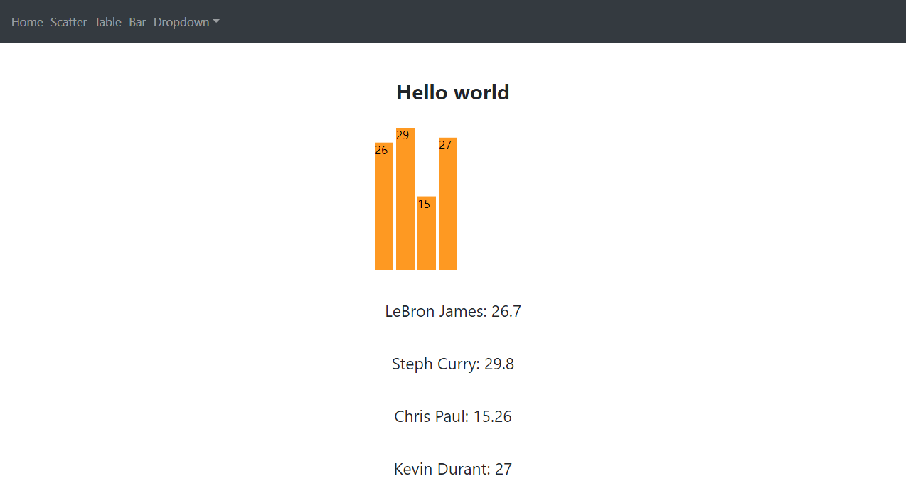

## Web App Boilerplate
ReactJS web app running inside a docker container.


### Frontend
ReactJS with D3.js
### Backend 
Flask REST API
### Database
MYSQL


## Run
```
docker-compose up --build
```
And it will build and start all the services. The database copies a database volume with some data. This probably needs to be changed to some .sql running on init.

React app will be on http://localhost:3000/

And the API will be at http://localhost:5000/api/players

The Database user and password is "root" and is on port 32000 for remote and 3306 internally.

Change ports in docker-compose.yml

